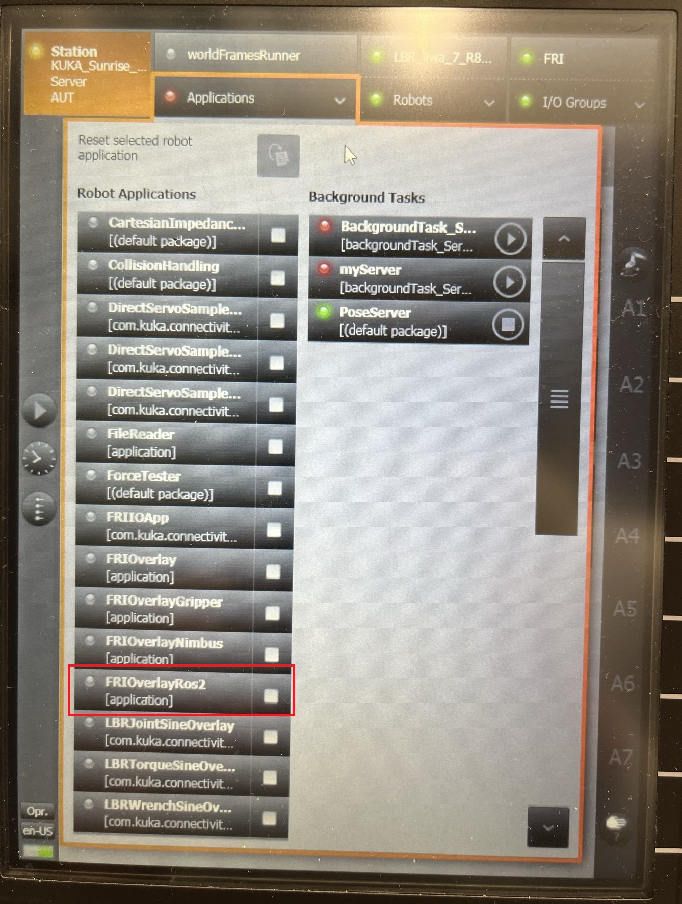
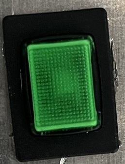
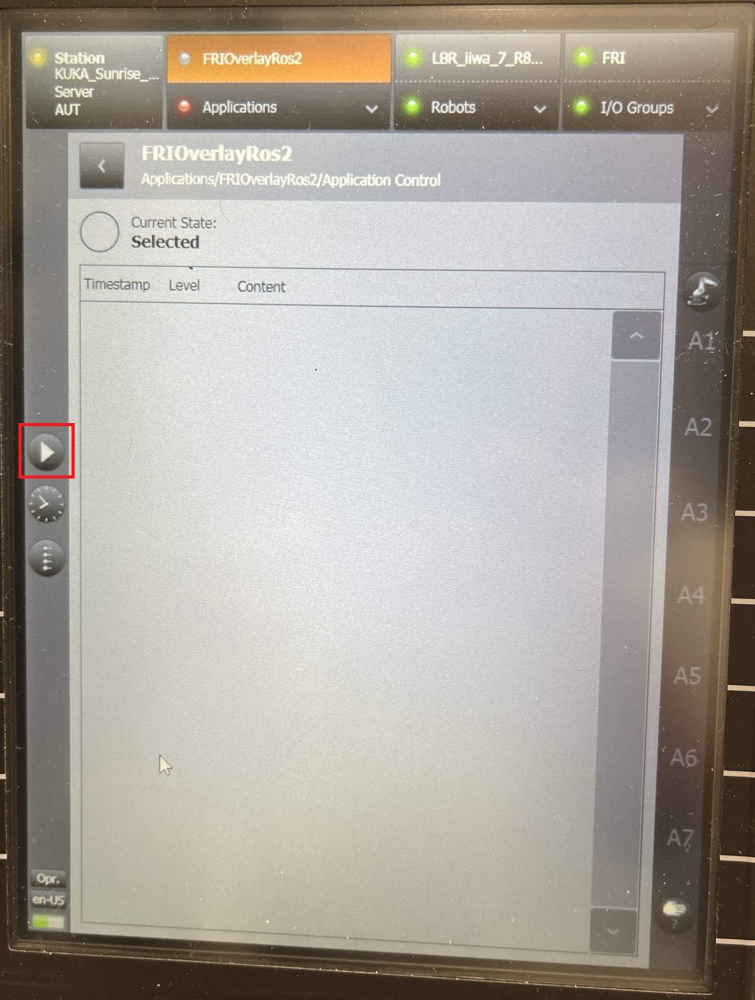
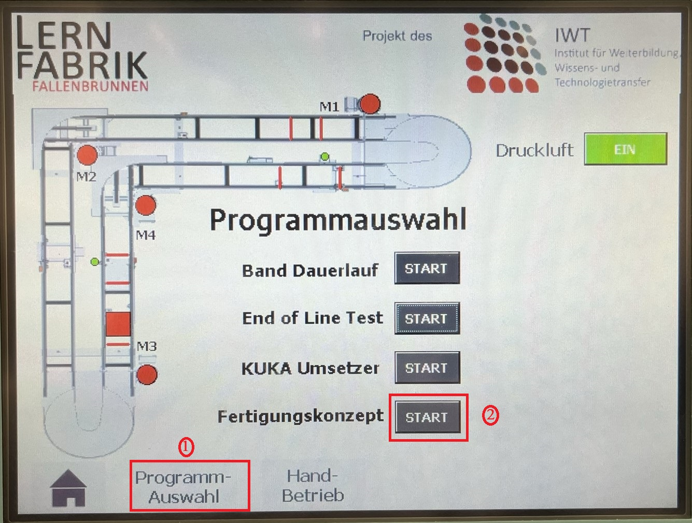

# kuka_iiwa7_ros2

[](https://github.com/LernFabrik/kuka_iiwa7_ros2/actions/workflows/ci-format.yml)

[](https://github.com/LernFabrik/kuka_iiwa7_ros2/actions/workflows/build.yml)

[](https://github.com/LernFabrik/kuka_iiwa7_ros2/actions/workflows/pages/pages-build-deployment)
## Installation ROS2 Packages
* Create workspace: `mkdir -p /ros_ws/colcon_kuka_ws/src`
* `cd /ros_ws/colcon_kuka_ws/src`
* Initialize the repository. (Here git clone won't work with docker)
    * `git init`
    * `git remote add origin https://github.com/LernFabrik/kuka_iiwa7_ros2.git`
    * `git fetch`
    * `git checkout main`
    * Please remember to properly setup your github account to pull and push the private repo
* Install Docker
    * Follow the steps to install docker for Ubuntu [here](https://docs.docker.com/engine/install/ubuntu/)
    * Follow the steps to install docker for Windows [here](https://docs.docker.com/desktop/install/windows-install/). This not test yet (not recommended).
    * Require docker compose for development process. Installation instruction is [here](https://docs.docker.com/compose/install/linux/)
    * (Optionally but required if you want to used NVIDIA for docker) Install *nvidia-docker2* [here](https://docs.nvidia.com/datacenter/cloud-native/container-toolkit/install-guide.html)(Only on Ubuntu)
### Runtime Docker
* `cd <absolute>/<path>/<to>/<colcon_ws>/src/scripts`
* `./run_env.sh`
### Development with Docker (ToDo: Without NVIDIA)
* `cd <absolute>/<path>/<to>/<colcon_ws>/src/docker`
* `docker compose up --build`

### Cyclone DDS
This project require cyclone DDS for Gripper Drivers
* `sudo apt install ros-humble-rmw-cyclonedds-cpp`
* `export RMW_IMPLEMENTATION=rmw_cyclonedds_cpp`

### Acttaching to the contailer
* Get the running container name: `docker ps`
* `docker exec -it <container name> /bin/bash`


## RUN
1. Start KUKA IIWA 7 and Bandumlaufsystem.
2. KUKA HMI
    - Select the Application --> **FRIOverlayRos2**

    
    
    - Press enable key.

    

    - Press RUN

    

3. ROS2
    - New terminal: `ros2 launch iwtros2_launch iwtros_env.launch.py` (Note: This command should be run within 15 second after pressing RUN in KUKA HMI)
    - New Terminal: `ros2 launch iwtros2_launch motion_controller.launch.py` (Note: If very system is working then should be able to see Gripper Homing)
4. Bandumlaufsystem:
    - Run programme in HMI

    

5. ROS2
    - New terminal: `ros2 run iwtros2_plc_controller plc_controller_node.py`

### Simulation Require config to fix time synch issue:
`ros2 param set /move_group use_sim_time true`
### Debug Command:
Open VSCode on your workspace, open the debug section (side bar) and create new launch.json configuration file for debugging. Configure as follow:

```
{
    "version": "0.2.0",
    "configurations": [
        {
            "name": "C++ Debugger",
            "request": "launch",
            "type": "cppdbg",
            "miDebuggerServerAddress": "localhost:3000",
            "cwd": "/",
            "program": "/home/vishnu/ros_ws/colcon_omron_ws/install/omron_driver/lib/omron_driver/omron_driver" #Change the file name accordingly
        }
    ]
}
```
`ros2 run  --prefix 'gdbserver localhost:3000' wsg50_driver gripper_server_node`
